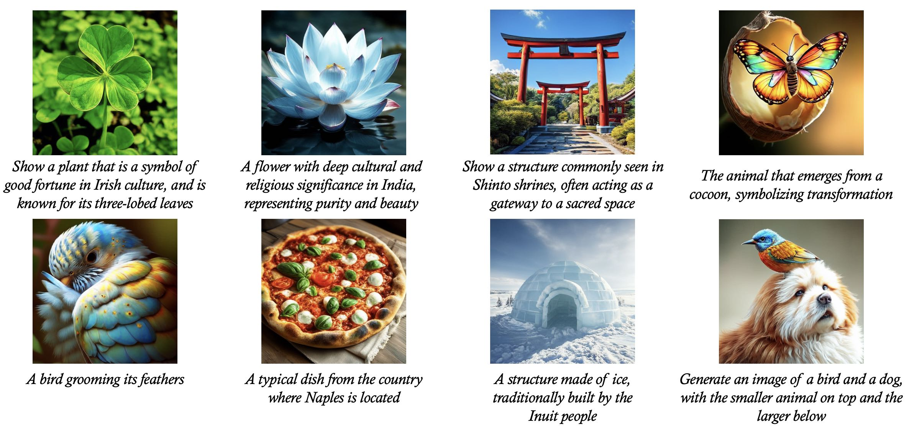
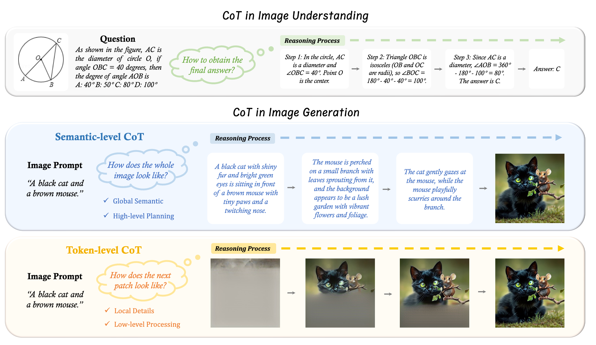

# 🌟🔥 T2I-R1: Reinforcing Image Generation with Collaborative Semantic-level and Token-level CoT

Official repository for the paper "[T2I-R1: Reinforcing Image Generation with Collaborative Semantic-level and Token-level CoT](https://arxiv.org/pdf/2505.00703)".

[[📖 Paper](https://arxiv.org/pdf/2505.00703)] [[🤗 Model](https://huggingface.co/CaraJ/T2I-R1)]

<p align="center">
     <br>
</p>

### 💥 News
- **[2025.09.18]** T2I-R1 has been accepted by NeurIPS 2025! 🎉🎉
- **[2025.06.12]** T2I-R1 has achieved the best result in open-source AR-based models in [TIIF-Bench](https://a113n-w3i.github.io/TIIF_Bench/)! 🔥
- **[2025.05.24]** We release the [checkpoint](https://huggingface.co/CaraJ/T2I-R1) of T2I-R1! 🔥
- **[2025.05.23]** Our new work exploring different RL Strategies for T2I is released: [Delving into RL for Image Generation with CoT: A Study on DPO vs. GRPO](https://arxiv.org/pdf/2505.17017) 🚀
- **[2025.05.02]** We release the [arxiv paper](https://arxiv.org/pdf/2505.00703) and the training code. 🔥
- **[2025.02.28]** Our previous work for Image Generation with CoT: [*Can We Generate Images with CoT? Let's Verify and Reinforce Image Generation Step by Step*](https://arxiv.org/pdf/2501.13926?) is accepted by **CVPR 2025** 🎉

## 👀 Reasoning in Image Generation

Chain-of-Thought (CoT) reasoning with reinforcement learning (RL) has been extensively explored by LLMs and LMMs. However, applying such reasoning strategies to the visual generation domain remains largely unexplored.  In this project, we provide **T2I-R1**, a novel reasoning-enhanced text-to-image generation model powered by RL with a bi-level CoT reasoning process.


<p align="center">
     <br>
</p>

We identify two levels of CoT that can be utilized to enhance different stages of generation:
1. 🧠 **Semantic-level CoT** is the **textual reasoning about the image to generate**, which is introduced prior to the image generation. The semantic-level CoT designs the **global structure** of the image, e.g., the appearance and location of each object.
   Optimizing the semantic-level CoT could explicitly manage the planning and reasoning of the prompt before the subsequent image tokens generation, making the generation easier.
   
3. 🎨 **Token-level CoT** is the intermediate patch-by-patch generation process of the image. Unlike semantic-level CoT, token-level CoT focuses on **low-level details** like pixel generation and maintaining visual coherence between adjacent patches. 
   Optimizing the token-level CoT can enhance both the generation quality and the alignment between the prompt and the resulting images.

To better coordinate these two levels of CoT, we introduce **BiCoT-GRPO** with an ensemble of generation rewards, which seamlessly **optimizes both generation CoTs within the same training step**:

<p align="center">
     <br>
</p>


### 🗒️ TODO

- [x] Release ORM Checkpoint and reward code 

- [x] Release Checkpoint

## 💪 Get Started
### Installation

Clone the repository:

   ```bash
   git clone https://github.com/CaraJ7/T2I-R1.git
   cd T2I-R1
   ```

Create a conda environment:

   ```bash
   conda create -n t2i-r1 python=3.10
   conda activate t2i-r1
   ```
   Please follow the official instructions [here](https://pytorch.org/get-started/locally/) to install both PyTorch and TorchVision dependencies.

   Install additional dependencies:
   ```bash
   cd src
   pip install -r requirements.txt
   ```
   Note that other newer versions of torch, transformers, and trl may also work.
   
### Set up the Reward Model Environment

**Make sure to install from our repo. We make some necessary modifications to train with Zero3.**

   Install GrouningDINO if you want to use Object Detector reward
   ```bash
   cd t2i-r1/src/t2i-r1/src/utils/GroundingDINO
   pip install -e .
   ```
   Install LLaVA if you want to use ORM reward
   ```bash
   cd t2i-r1/src/t2i-r1/src/utils/LLaVA-NeXT
   pip install -e ".[train]"
   ```

### Prepare Reward Model Checkpoints

   Please download the reward model you need for training.

   ```bash
   cd t2i-r1
   mkdir reward_weight
   cd reward_weight
   ```

   - Download HPS checkpoint from [this link](https://huggingface.co/xswu/HPSv2/resolve/main/HPS_v2.1_compressed.pt) by
   ```bash
   wget https://huggingface.co/xswu/HPSv2/resolve/main/HPS_v2.1_compressed.pt
   ```
   - Download GIT checkpoint from [this link](https://huggingface.co/microsoft/git-large-vqav2) by
   ```bash
   huggingface-cli download microsoft/git-large-vqav2 --repo-type model --local-dir git-large-vqav2
   ```

   - Download GroundingDINO checkpoint from [this link](https://github.com/IDEA-Research/GroundingDINO/releases/download/v0.1.0-alpha/groundingdino_swint_ogc.pth) by
   ```bash
   wget https://github.com/IDEA-Research/GroundingDINO/releases/download/v0.1.0-alpha/groundingdino_swint_ogc.pth
   ```

   - Download ORM checkpoint from [this link](https://huggingface.co/CaraJ/ORM-T2I-R1) by
   ```bash
   huggingface-cli download CaraJ/ORM-T2I-R1 --repo-type model --local-dir ORM-T2I-R1
   ```

### 🚀 Training 

```bash
cd t2i-r1/src
bash scripts/run_grpo.sh
```

Notes:
+ Parameters:
   - reward_funcs: The options are `hps`, `git`, `gdino`, `orm`. You can choose whatever composition you need for training. Make sure to substitute the correct checkpoint path and config path in the `run_grpo.sh`


### 💫 Inference   
You can download the checkpoint from [here](https://huggingface.co/CaraJ/T2I-R1) or train the model by yourself.

```
cd t2i-r1/src/infer
python reason_inference.py \
--model_path YOUR_MODEL_CKPT \
--data_path test_data.txt 
```

### 📒 Notes
+ When necessary, we incorporate the corresponding repo from the reward model we use. We modify certain code to adapt for Zero3 training and delete unused folders to maintain a lightweight codebase.
   + For GroundingDINO, we modify the code in `t2i-r1/src/t2i-r1/src/utils/GroundingDINO/groundingdino/models/GroundingDINO/groundingdino.py`.
   + For LLaVA (ORM), we modify the code in `t2i-r1/src/t2i-r1/src/utils/LLaVA-NeXT/llava/model/builder.py` and `t2i-r1/src/t2i-r1/src/utils/LLaVA-NeXT/llava/model/llava_arch.py`.

### 🧠 Related Work

Explore our additional research on **Autoregressive Text-to-Image Generation** and  **CoT Reasoning** 

- **[Image Generation CoT]** [Can We Generate Images with CoT? Let's Verify and Reinforce Image Generation Step by Step?](https://arxiv.org/pdf/2501.13926)
- **[MME-CoT]** [MME-CoT: Benchmarking Chain-of-Thought in Large Multimodal Models for Reasoning Quality, Robustness, and Efficiency](https://mmecot.github.io)
- **[TIIF-Bench]** [TIIF-Bench: How Does Your T2I Model Follow Your Instructions?](https://a113n-w3i.github.io/TIIF_Bench/)
- **[MathVerse]** [MathVerse: Does Your Multi-modal LLM Truly See the Diagrams in Visual Math Problems?](https://mathverse-cuhk.github.io)
- **[MAVIS]** [MAVIS: Mathematical Visual Instruction Tuning with an Automatic Data Engine](https://arxiv.org/pdf/2407.08739)
- **[MMSearch]** [MMSearch: Unveiling the Potential of Large Models as Multi-modal Search Engines](https://mmsearch.github.io/)

### 🥳 Acknowledgements
We would like to thank [R1-V](https://github.com/Deep-Agent/R1-V) and [Image Generation CoT](https://github.com/ZiyuGuo99/Image-Generation-CoT), upon which our repo is built.

### Lincense
This project is released under [Apache License 2.0](https://github.com/CaraJ7/T2I-R1/blob/main/LICENSE). We release our checkpoints for research purposes only. Users are granted the freedom to create images using this tool, but they are expected to comply with local laws and utilize it in a responsible manner. The developers do not assume any responsibility for potential misuse by users.

### 📄 Cite
```
@article{jiang2025t2i,
  title={T2I-R1: Reinforcing Image Generation with Collaborative Semantic-level and Token-level CoT},
  author={Jiang, Dongzhi and Guo, Ziyu and Zhang, Renrui and Zong, Zhuofan and Li, Hao and Zhuo, Le and Yan, Shilin and Heng, Pheng-Ann and Li, Hongsheng},
  journal={arXiv preprint arXiv:2505.00703},
  year={2025}
}
```
